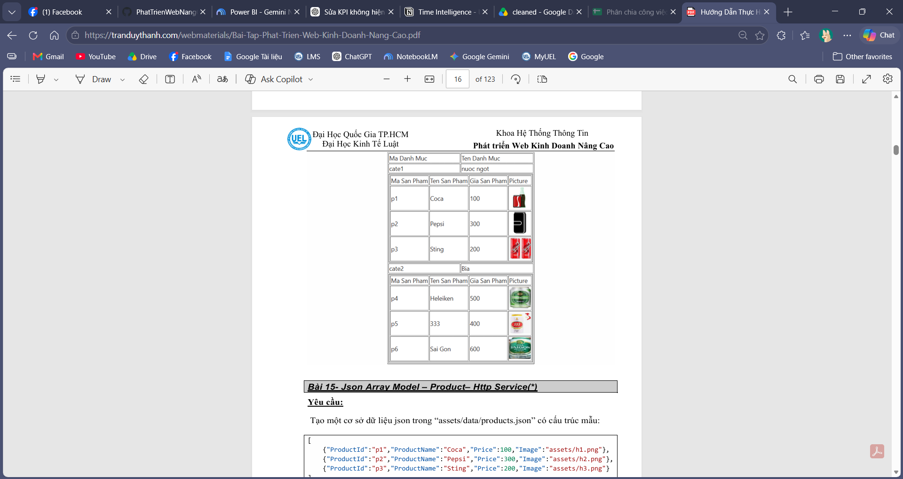

Bài 14- Json Array Model – Product - Catalog 
Yêu cầu: 
Cho CatalogService có cấu trúc như dưới đây: 
export class CatalogService { 
  datas=[ 
    {"Cateid":"cate1","CateName":"nuoc ngot", 
      "Products":[ 
        {"ProductId":"p1","ProductName":"Coca","Price":100, 
"Image":"assets/h1.png"}, 
        {"ProductId":"p2","ProductName":"Pepsi","Price":300, 
"Image":"assets/h2.png"}, 
        {"ProductId":"p3","ProductName":"Sting","Price":200, 
"Image":"assets/h3.png"}, 
      ] 
    }, 
    {"Cateid":"cate2","CateName":"Bia", 
      "Products":[ 
        {"ProductId":"p4","ProductName":"Heleiken","Price":500, 
"Image":"assets/h4.png"}, 
        {"ProductId":"p5","ProductName":"333","Price":400, 
"Image":"assets/h5.png"}, 
        {"ProductId":"p6","ProductName":"Sai Gon","Price":600, 
"Image":"assets/h6.png"}, 
      ] 
    }, 
  ] 
   
  constructor() { } 
  getCategories() 
  { 
    return this.datas     
  } 
} 
 
 - Tạo component và dùng ngFor lồng nhau để hiển thị danh mục và sản phẩm như 
hình dưới đây:

